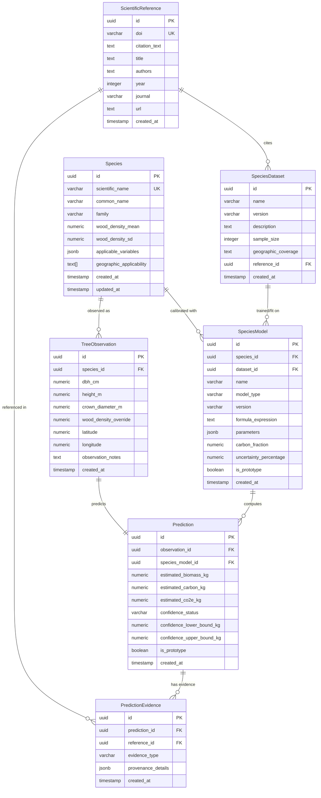

# GoNax Database Schema Specification

This document details the relational PostgreSQL schema for GoNax.

## Entity-Relationship Diagram

## Indexes
- `idx_species_scientific_name` on `species(scientific_name)`
- `idx_species_common_name` on `species(common_name)`
- `idx_species_models_species_id` on `species_models(species_id)`
- `idx_tree_observations_species_id` on `tree_observations(species_id)`
- `idx_predictions_observation_id` on `predictions(observation_id)`
- `idx_predictions_created_at` on `predictions(created_at DESC)`
- `idx_prediction_evidences_prediction_id` on `prediction_evidences(prediction_id)`
